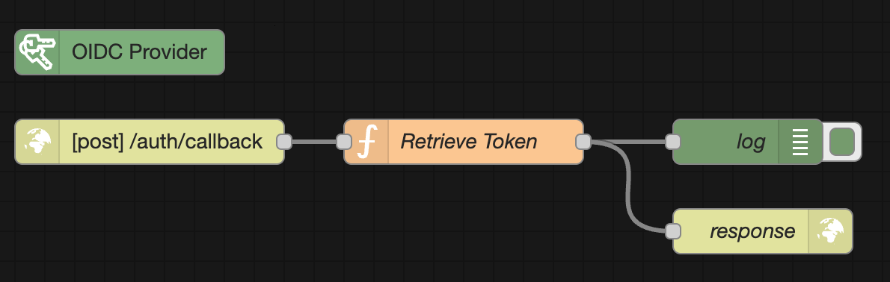
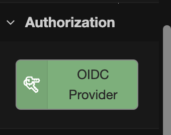
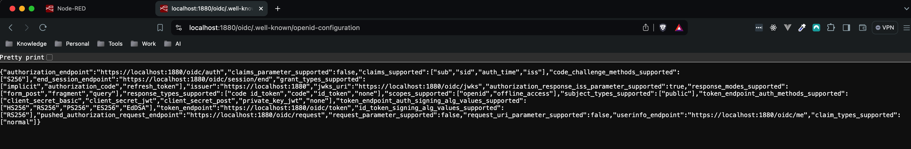
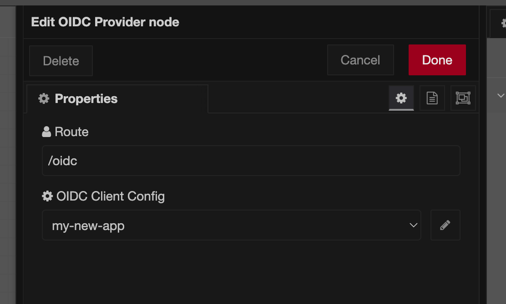
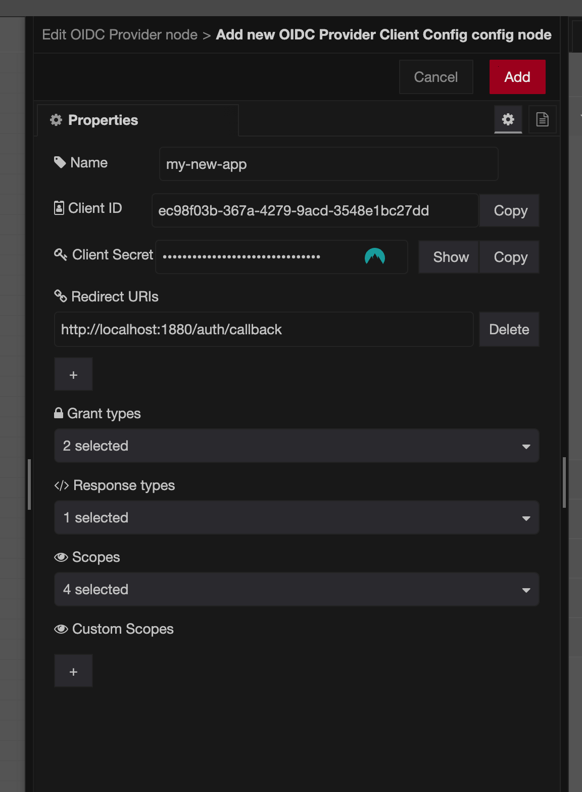

# Node-red OIDC Provider node

With this node, you can easily set up an [OIDC (OpenID Connect) Authentication Server](https://openid.net/specs/openid-connect-core-1_0-errata2.html).

### Palette view

### /.well-known/openid-configuration response

### Forms

> [!WARNING]
> The following forms are an initial implementation.

#### oidc-provider-node

#### oidc-provider-config-node

